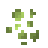

# Minecraft Spawn Egg Preview
A *very simple* REST API for Minecraft Spawn Egg preview.

> [!NOTE]
> Probably in the future the same logic will be applied to other game elements that use a customizable color matrix (leaves, water etc).

## Endpoints

`GET` /<base_color>/<overlay_color>

Returns the full preview of a Spawn Egg. `#` is not parsed on the URL! Colors must be `F0F0F0` instead of `#F0F0F0`.

## Roadmap

- [ ] A Visual Studio Code extension
  - The idea is create a side-project using this API to preview the Spawn Egg when hover at `spawn_egg` property from a client-side entity file of Minecraft Bedrock Edition resource pack. Can be util for Add-Ons developers that want to be sure to not repeat colors or put similar colos on base and overlay.

## Logic
The main idea from the API is get the parsed HEX Color and convert into a Color Matrix and merge with Grayscale texture of the Spawn Egg.

|   | Hexadecimal Color | Color Matrix | Preview |
|:-:|:-------------------:|:--------------:|:---------:|
|| #8073FF | [0.5..., 0, 0, 0, 0, 0, 0.45.., 0, 0, 0, 0, 0, 1, 0, 0, 0, 0, 0, 1, 0] ||
|| #D4FF7A | [0.83..., 0, 0, 0, 0, 0, 1, 0, 0, 0, 0, 0, 0.48..., 0, 0, 0, 0, 0, 1, 0] ||
|ㅤㅤㅤ|ㅤㅤㅤ|ㅤㅤㅤ|ㅤㅤㅤㅤㅤㅤㅤㅤㅤㅤㅤ|
||                   |              ||

---

  <h3>Seface Studios</h3>
  
<a href="mailto:contact@sefacestudios.net">contact@sefacestudios.net</a> · <a title="X/Twitter" href="https://x.com/SefaceStudios">@SefaceStudios</a>

